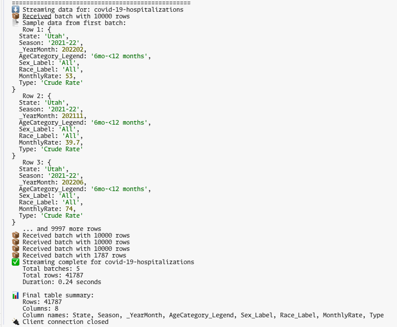
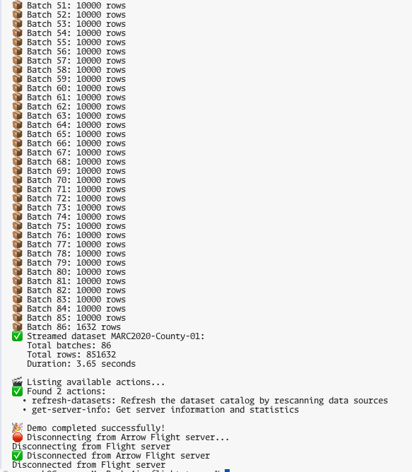

# FlightStream

[](https://opensource.org/licenses/MIT)
[](https://nodejs.org/)
[](https://www.npmjs.com/package/@flightstream/core-server)

A comprehensive, high-performance Apache Arrow Flight streaming framework for Node.js that enables efficient, real-time data streaming across distributed systems. Built with a modular plugin architecture, FlightStream provides both server-side streaming capabilities and client-side data access patterns, making it ideal for modern data pipelines, analytics applications, and microservices architectures.

## Key Capabilities

- **🚀 High-Performance Streaming**: Leverage Apache Arrow's columnar format for efficient data transfer
- **🔌 Plugin Architecture**: Extensible adapter system supporting CSV, with plans for databases, APIs, and more
- **🌐 Cross-Platform**: Works with any Arrow Flight client (Python, Java, C++, JavaScript, R, Go)
- **⚡ Memory Efficient**: Basic streaming with batch processing for large datasets
- **🛡️ Alpha Release**: Good error handling and retry logic foundations, but not production-ready
- **📊 Schema Intelligence**: Automatic schema inference and validation
- **💻 Developer Friendly**: Rich examples, comprehensive documentation, and easy setup

## Use Cases

- **Data Engineering**: Stream CSV files to analytics engines (Apache Spark, DuckDB, Pandas)
- **API Modernization**: Replace REST APIs with efficient columnar data transfer
- **Real-time Analytics**: Power dashboards and BI tools with live data streams
- **Microservices**: Enable high-performance data sharing between services
- **Multi-language Integration**: Connect applications written in different programming languages

> **⚠️ Alpha Release**: This is currently in alpha. APIs may change between releases. This is not production-ready software. For production use, consider waiting for the stable release or pinning to a specific alpha version.

## 🚀 Quick Start

Get FlightStream running in under 2 minutes:

```bash
# Clone and install
git clone https://github.com/ggauravr/flightstream.git
cd flightstream
npm install

# Start the development server using data from the `data` directory and the CSV adapter (with auto-reload)
npm run dev
```

In a new terminal:
```bash
# Run the test client to stream data. Streams the first dataset found
npm test

# Run the test client with a specific dataset
npm test <datasetid>
```

### Expected Output

#### Server Terminal (`npm run dev`):


#### Client Terminal (`npm test`):


That's it! The server will automatically discover CSV files in the `data/` directory and stream them via Arrow Flight protocol. The test client will connect and display the streamed data in real-time. As you can see a CSV with ~41k rows is streamed to the client in .25s!

#### Client Terminal With a Specific Dataset(`npm test MARC2020-County-01`):


The test client will connect and display the streamed data specificed by the dataset id in real-time. In the example above, CSV with ~800k rows is streamed to the client in <4s!

### What just happened?
- 🚀 **Flight Server**: Started on `localhost:8080` with CSV adapter
- 📊 **Sample Data**: Automatically discovered from `./data/` directory  
- 🔗 **Test Client**: Connected via gRPC and streamed Arrow data
- ⚡ **Live Reload**: Server restarts automatically when you modify code

## 📦 Package Structure

This monorepo is organized by domain for maximum scalability and extensibility:

### Core Packages ✅

| Package | Description | Version |
|---------|-------------|---------|
| [`@flightstream/core-server`](packages/core/server/) | Core Arrow Flight NodeJS server with plugin architecture |  |
| [`@flightstream/core-client`](packages/core/client/) | Core Arrow Flight NodeJS client with connection management |  |
| [`@flightstream/core-shared`](packages/core/shared/) | Shared utilities, constants, and protocol handling |  |

### Adapters ✅

| Package | Description | Version |
|---------|-------------|---------|
| [`@flightstream/adapters-csv`](packages/adapters/csv/) | CSV file adapter with streaming support and schema inference |  |

### Utilities ✅

| Package | Description | Version |
|---------|-------------|---------|
| [`@flightstream/utils-arrow`](packages/utils/arrow/) | Advanced Arrow utilities, schema inference, and type system |  |

## 🏗️ Architecture

```
┌─────────────────┐    ┌─────────────────┐    ┌─────────────────┐
│   Data Sources  │───▶│  FlightStream   │───▶│     Clients     │
│      (CSV)      │    │   Framework     │    │ (gRPC clients)  │
└─────────────────┘    └─────────────────┘    └─────────────────┘
                              │
                              ▼
                       ┌─────────────────┐
                       │ Plugin Adapters │
                       │ (Extensible)    │
                       └─────────────────┘
```

The framework uses a domain-driven architecture where:
- **Core packages** provide fundamental server and client functionality
- **Adapters** connect to different data sources (CSV)
- **Utilities** provide shared functionality across packages
- **Examples** demonstrate usage patterns and best practices

## 🎯 Use Cases

### Server-Side ✅ (Currently Implemented)
- **CSV Data Streaming**: Serve CSV files via Arrow Flight protocol
- **Analytics Pipelines**: Stream data to Apache Spark, DuckDB, or custom analytics
- **API Modernization**: Replace REST APIs with efficient columnar data transfer
- **Multi-language Integration**: Connect Python, Java, C++, and JavaScript applications

### Client-Side ✅ (Currently Implemented)
- **Data Access**: Connect to Arrow Flight servers and retrieve datasets
- **Streaming Data**: Memory-efficient streaming of large datasets
- **Connection Management**: Automatic connection handling with retry logic
- **Cross-language Clients**: Use with any Arrow Flight client library

## 📊 Features

### Currently Implemented ✅
- ✅ High-performance gRPC streaming
- ✅ Memory-efficient batch processing  
- ✅ Automatic schema inference
- ✅ Error handling and retry logic
- ✅ Domain-driven package architecture
- ✅ Comprehensive documentation
- ✅ Example implementations (server and client)
- ✅ All major Flight operations (ListFlights, GetFlightInfo, DoGet, etc.)
- ✅ Efficient binary data transfer
- ✅ Schema discovery and validation
- ✅ Streaming with backpressure handling
- ✅ Connection management and lifecycle
- ✅ Configurable logging system
- ✅ Client connection management with automatic retries
- ✅ Event-driven client architecture
- ✅ Shared protocol utilities and constants
- ✅ Advanced Arrow utilities and type system

## 🛠️ Installation & Usage

### Alpha Release Status

FlightStream is currently in **alpha**. This means:

- ✅ Core server functionality is implemented and working
- ✅ Core client functionality is implemented and working
- ✅ Shared utilities and protocol handling is implemented
- ✅ CSV adapter with streaming support is available
- ✅ Plugin architecture supports extensible data source adapters
- ✅ Comprehensive server and client examples included
- ✅ Advanced Arrow utilities and type system implemented
- ⚠️ APIs may change between releases
- ⚠️ Not recommended for production use
- ⚠️ Limited error handling and edge cases
- ⚠️ Performance optimizations pending

## 🔧 Configuration

Configure via environment variables:

```bash
# Server settings
export FLIGHT_HOST=localhost
export FLIGHT_PORT=8080

# Data settings  
export DATA_DIRECTORY=./data
export CSV_BATCH_SIZE=10000

# Performance tuning
export MAX_RECEIVE_MESSAGE_LENGTH=104857600  # 100MB
export MAX_SEND_MESSAGE_LENGTH=104857600     # 100MB
```

## 🧪 Development

### Prerequisites
- Node.js ≥ 18.0.0
- npm ≥ 8.0.0

### Setup
```bash
# Install dependencies
npm install

# Run tests
npm test

# Lint code
npm run lint

# Build packages
npm run build
```

### Domain-Specific Commands

```bash
# Server packages
npm run test:server
npm run build:server
npm run lint:server

# Utility packages
npm run test:utils
npm run build:utils
npm run lint:utils

# Examples
npm run test:examples
```

### Package Development

```bash
# Test specific package
npm run test:server

# Build specific package
npm run build:server

# Lint specific package
npm run lint:server
```

## 📈 Current Status

### Phase 1: Core Ecosystem ✅ (Complete)
- [x] Core server framework with plugin architecture
- [x] Core client framework with connection management
- [x] Shared utilities and protocol handling
- [x] CSV adapter with streaming support and schema inference
- [x] Advanced Arrow utilities and type system
- [x] Server and client examples
- [x] Plugin architecture for extensible data sources

## 🤝 Contributing

I welcome contributions! Please see our [Contributing Guide](CONTRIBUTING.md) for details.

### Development Workflow

1. **Fork** the repository
2. **Create** a feature branch (`git checkout -b feature/amazing-feature`)
3. **Commit** your changes (`git commit -m 'Add amazing feature'`)
4. **Push** to the branch (`git push origin feature/amazing-feature`)
5. **Open** a Pull Request

### Package Development

When adding new packages:

1. **Choose the right domain**: Core, Adapters, Frameworks, Utils, Examples, or Tools
2. **Follow naming conventions**: `@flightstream/{domain}-{name}`
3. **Update dependencies**: Use peer dependencies for shared packages
4. **Add tests**: Include comprehensive test coverage
5. **Update documentation**: Document the new package and its usage

## 📄 License

This project is licensed under the MIT License - see the [LICENSE](LICENSE) file for details.

## 🙏 Acknowledgments

- [Apache Arrow](https://arrow.apache.org/) for the columnar data format
- [DuckDB](https://duckdb.org/) for the embedded analytical database and the mind-blowing single-node performance
- [gRPC](https://grpc.io/) for the high-performance RPC framework 
- [Apache Arrow Flight](https://arrow.apache.org/docs/format/Flight.html) for the amazing message transfer protocol