# 🤝 Contributing to Arrow Flight Server Node.js

Thank you for your interest in contributing! This guide will help you get started with contributing to the Arrow Flight Server Node.js framework.

## 🎯 Ways to Contribute

### 🐛 Bug Reports
Found a bug? Please [open an issue](https://github.com/ggauravr/flightstream/issues) with:
- Clear description of the problem
- Steps to reproduce
- Expected vs actual behavior
- Your environment (Node.js version, OS, etc.)

### 💡 Feature Requests
Have an idea for improvement? [Create a feature request](https://github.com/ggauravr/flightstream/issues) with:
- Use case description
- Proposed solution
- Alternative approaches considered

### 📝 Documentation
Help improve our docs:
- Fix typos or unclear explanations
- Add examples or tutorials
- Improve API documentation
- Translate content

### 🔧 Code Contributions
- Fix bugs
- Implement new features
- Add new adapters
- Improve performance
- Add tests

## 🚀 Getting Started

### Prerequisites
- **Node.js 18+** - [Download here](https://nodejs.org/)
- **Git** - For version control
- **GitHub account** - For submitting PRs

### Development Setup

1. **Fork the repository**
   ```bash
   # Visit https://github.com/ggauravr/flightstream
   # Click "Fork" button
   ```

2. **Clone your fork**
   ```bash
   git clone https://github.com/YOUR-USERNAME/flightstream.git
   cd flightstream
   ```

3. **Install dependencies**
   ```bash
   npm install
   ```

4. **Create a branch**
   ```bash
   git checkout -b feature/your-feature-name
   # or
   git checkout -b fix/bug-description
   ```

5. **Start development**
   ```bash
   # Start the example server
   npm start
   
   # In another terminal, test your changes
   npm test
   ```

## 🏗️ Project Structure

Understanding the codebase organization:

```
flightstream/
├── packages/
│   ├── core/              # Core Flight server framework
│   │   ├── src/
│   │   │   ├── flight-server.js
│   │   │   ├── flight-service-base.js
│   │   │   └── protocol-handlers.js
│   │   └── package.json
│   ├── csv-service/       # CSV file adapter
│   │   ├── src/
│   │   │   ├── csv-service.js
│   │   │   └── csv-streamer.js
│   │   └── package.json
│   ├── utils/            # Shared utilities
│   │   ├── src/
│   │   │   ├── arrow-builder.js
│   │   │   └── schema-inference.js
│   │   └── package.json
│   └── examples/         # Reference implementations
│       ├── basic-server/
│       └── test-client/
├── docs/                 # Documentation website
├── data/                 # Sample data files
└── tools/               # Development tools
```

## 🧠 Mental Model

```mermaid
flowchart TD
    Start([Developer Starts]) --> Choice{What data source?}
    
    Choice -->|CSV Files| InstallCSV[Install @flightstream/csv-service]
    Choice -->|Database| InstallDB[Install @flightstream/xxx-service<br/>Future: snowflake, postgres, etc.]
    Choice -->|Custom| InstallCore[Install @flightstream/core + utils]

    InstallCSV --> CreateCSVServer[Create CSV Server]
    InstallDB --> CreateDBServer[Create Database Server]
    InstallCore --> CreateCustomServer[Create Custom Adapter]

    subgraph "CSV Service Usage"
        CreateCSVServer --> ConfigCSV[Configure CSV Options<br/>• Data directory<br/>• Batch size<br/>• Delimiter]
        ConfigCSV --> InitCSV[CSVFlightService.initialize<br/>Discovers CSV files]
        InitCSV --> RegisterCSV[Register with FlightServer]
    end

    subgraph "Custom Adapter Development"
        CreateCustomServer --> ExtendBase[Extend FlightServiceBase]
        ExtendBase --> ImplementMethods[Implement Required Methods<br/>• _initialize<br/>• _inferSchemaForDataset<br/>• _streamDataset]
        ImplementMethods --> UseUtils[Use ArrowBuilder utilities<br/>for data conversion]
        UseUtils --> RegisterCustom[Register with FlightServer]
    end

    RegisterCSV --> StartServer[Start FlightServer]
    CreateDBServer --> StartServer
    RegisterCustom --> StartServer

    StartServer --> ClientConnect[Clients Connect via Arrow Flight]
    ClientConnect --> Operations[Flight Operations<br/>• ListFlights<br/>• GetFlightInfo<br/>• DoGet]

    subgraph "Data Flow"
        Operations --> Discovery[Dataset Discovery]
        Discovery --> Schema[Schema Inference]
        Schema --> Stream[Stream Arrow Data]
        Stream --> Client[Client Receives<br/>Arrow RecordBatches]
    end

    %% Styling
    classDef startEnd fill:#c8e6c9,stroke:#4caf50,stroke-width:3px
    classDef process fill:#bbdefb,stroke:#2196f3,stroke-width:2px
    classDef decision fill:#ffe0b2,stroke:#ff9800,stroke-width:2px
    classDef service fill:#f8bbd9,stroke:#e91e63,stroke-width:2px

    class Start,Client startEnd
    class Choice decision
    class CreateCSVServer,CreateDBServer,CreateCustomServer,StartServer,ClientConnect,Operations process
    class ConfigCSV,InitCSV,RegisterCSV,ExtendBase,ImplementMethods,UseUtils,RegisterCustom,Discovery,Schema,Stream service
```



## 📋 Development Guidelines

### Code Style

This project uses ESLint for code formatting:

```bash
# Check code style
npm run lint

# Fix auto-fixable issues
npm run lint -- --fix
```

**Key principles:**
- Use modern ES6+ features
- Prefer `async/await` over callbacks
- Use descriptive variable names
- Add JSDoc comments for public APIs
- Follow existing patterns in the codebase

### Commit Messages

Follow the [Conventional Commits](https://conventionalcommits.org/) format:

```
type(scope): description

[optional body]

[optional footer]
```

**Examples:**
```bash
feat(csv): add support for custom delimiters
fix(core): handle connection errors gracefully
docs(api): update FlightServer constructor examples
test(utils): add tests for schema inference
```

**Types:**
- `feat`: New feature
- `fix`: Bug fix
- `docs`: Documentation changes
- `test`: Test additions/changes
- `refactor`: Code refactoring
- `perf`: Performance improvements
- `chore`: Maintenance tasks

### Testing

#### Running Tests
```bash
# Run all tests
npm test

# Test specific package
cd packages/core
npm test

# Test with coverage
npm test -- --coverage
```

#### Writing Tests
```javascript
// Example test structure
import { FlightServer } from '../src/flight-server.js';

describe('FlightServer', () => {
  let server;
  
  beforeEach(() => {
    server = new FlightServer({ port: 8081 });
  });
  
  afterEach(async () => {
    if (server) {
      await server.stop();
    }
  });
  
  test('should start and stop server', async () => {
    const port = await server.start();
    expect(port).toBe(8081);
    
    await server.stop();
    // Server should be stopped
  });
});
```

## 🔌 Contributing New Adapters

### Adapter Structure

Create a new adapter by extending `FlightServiceBase`:

```javascript
// packages/my-adapter/src/my-adapter.js
import { FlightServiceBase } from '@flightstream/core';
import { ArrowBuilder } from '@flightstream/utils';

export class MyFlightService extends FlightServiceBase {
  constructor(options = {}) {
    super(options);
    this.connectionString = options.connectionString;
  }

  async _initialize() {
    // Connect to your data source
    // Discover available datasets
    // Register datasets in this.datasets Map
  }

  async _inferSchemaForDataset(datasetId) {
    // Examine dataset structure
    // Return Arrow schema object
  }

  async _streamDataset(call, dataset) {
    // Stream data as Arrow record batches
    // Handle batching and pagination
  }
}
```

### Adapter Package Structure

```
packages/my-adapter/
├── src/
│   ├── index.js          # Main exports
│   ├── my-adapter.js     # Main adapter class
│   └── helper.js         # Helper utilities
├── tests/
│   └── my-adapter.test.js
├── package.json
└── README.md
```

### Adapter Checklist

- [ ] Extends `FlightServiceBase`
- [ ] Implements all required methods
- [ ] Handles errors gracefully
- [ ] Includes comprehensive tests
- [ ] Has clear documentation
- [ ] Follows project conventions
- [ ] Includes example usage

## 📝 Documentation Guidelines

### README Files
Each package should have a README with:
- Purpose and features
- Installation instructions
- Basic usage examples
- API reference
- Configuration options

### Code Documentation
Use JSDoc for public APIs:

```javascript
/**
 * Create a new Flight server instance
 * @param {Object} options - Server configuration
 * @param {string} [options.host='localhost'] - Server host
 * @param {number} [options.port=8080] - Server port
 * @example
 * const server = new FlightServer({ port: 9090 });
 */
constructor(options = {}) {
  // Implementation
}
```

### Examples
Include working examples that:
- Demonstrate real-world usage
- Include sample data
- Work out of the box
- Cover edge cases

## 🧪 Testing Guidelines

### Test Coverage
Aim for high test coverage:
- Unit tests for individual functions
- Integration tests for components
- End-to-end tests for complete workflows

### Test Categories

#### Unit Tests
```javascript
// Test individual functions/methods
test('ArrowBuilder creates valid schema', () => {
  const builder = new ArrowBuilder({ id: 'int64' });
  const schema = builder.getSchema();
  expect(schema).toBeDefined();
});
```

#### Integration Tests
```javascript
// Test component interactions
test('CSV service discovers files', async () => {
  const adapter = new CSVFlightService({ dataDirectory: './test-data' });
  await adapter.initialize();
  expect(adapter.getDatasets()).toContain('sample');
});
```

#### End-to-End Tests
```javascript
// Test complete workflows
test('server serves CSV data to client', async () => {
  const server = new FlightServer({ port: 8082 });
  const service = new CSVFlightService({ dataDirectory: './test-data' });
  
  server.setFlightService(service);
  await server.start();
  
  const client = new FlightClient('localhost', 8082);
  const flights = await client.listFlights();
  
  expect(flights.length).toBeGreaterThan(0);
  
  await server.stop();
});
```

## 🚀 Submitting Changes

### Before Submitting
1. **Run tests**: `npm test`
2. **Check linting**: `npm run lint`
3. **Test examples**: `npm start` and `npm test`
4. **Update documentation** if needed
5. **Add tests** for new features

### Pull Request Process

1. **Push to your fork**
   ```bash
   git add .
   git commit -m "feat(adapter): add PostgreSQL adapter"
   git push origin feature/postgresql-adapter
   ```

2. **Create Pull Request**
   - Go to GitHub repository
   - Click "New Pull Request"
   - Choose your branch
   - Fill out PR template

3. **PR Description Should Include:**
   - What changes were made
   - Why they were needed
   - How to test the changes
   - Screenshots (if UI changes)
   - Breaking changes (if any)

### PR Template
```markdown
## Description
Brief description of changes

## Type of Change
- [ ] Bug fix
- [ ] New feature
- [ ] Breaking change
- [ ] Documentation update

## Testing
- [ ] Tests pass locally
- [ ] Added tests for new functionality
- [ ] Manual testing completed

## Checklist
- [ ] Code follows project style
- [ ] Self-review completed
- [ ] Documentation updated
- [ ] No breaking changes (or clearly documented)
```

## 🔍 Review Process

### What We Look For
- **Functionality**: Does it work as intended?
- **Code Quality**: Is it clean, readable, maintainable?
- **Testing**: Are there adequate tests?
- **Documentation**: Is it well documented?
- **Performance**: Does it perform well?
- **Compatibility**: Does it break existing functionality?

### Review Timeline
- Initial review: Within 3-5 days
- Follow-up reviews: Within 1-2 days
- Merge: After approval and all checks pass

## 🎉 Recognition

Contributors are recognized in:
- Project README
- Release notes
- Contributors page
- Annual contributor highlights

## ❓ Getting Help

### Community Support
- **GitHub Discussions**: [Community discussions](https://github.com/ggauravr/flightstream/discussions)
- **Issues**: [Bug reports and questions](https://github.com/ggauravr/flightstream/issues)

### Development Help
- **Discord**: Join our development chat
- **Office Hours**: Weekly contributor meetings
- **Mentorship**: Pair programming sessions for new contributors

## 📜 Code of Conduct

This project follows the [Contributor Covenant Code of Conduct](https://www.contributor-covenant.org/). By participating, you agree to:

- Use welcoming and inclusive language
- Respect differing viewpoints and experiences
- Accept constructive criticism gracefully
- Focus on what's best for the community
- Show empathy toward other community members

## 🏆 Contributor Levels

### 🌱 First-time Contributors
- Start with "good first issue" labels
- Get help from maintainers
- Learn the codebase gradually

### 🌿 Regular Contributors
- Take on larger features
- Help review other PRs
- Improve documentation and examples

### 🌳 Core Contributors
- Help with project direction
- Mentor new contributors
- Release management

## 📊 Development Metrics

We track these metrics to understand project health:
- Response time to issues/PRs
- Test coverage percentage
- Code quality scores
- Community engagement

Thank you for contributing to Arrow Flight Server Node.js! 🚀

Your contributions help make high-performance data streaming accessible to everyone. 