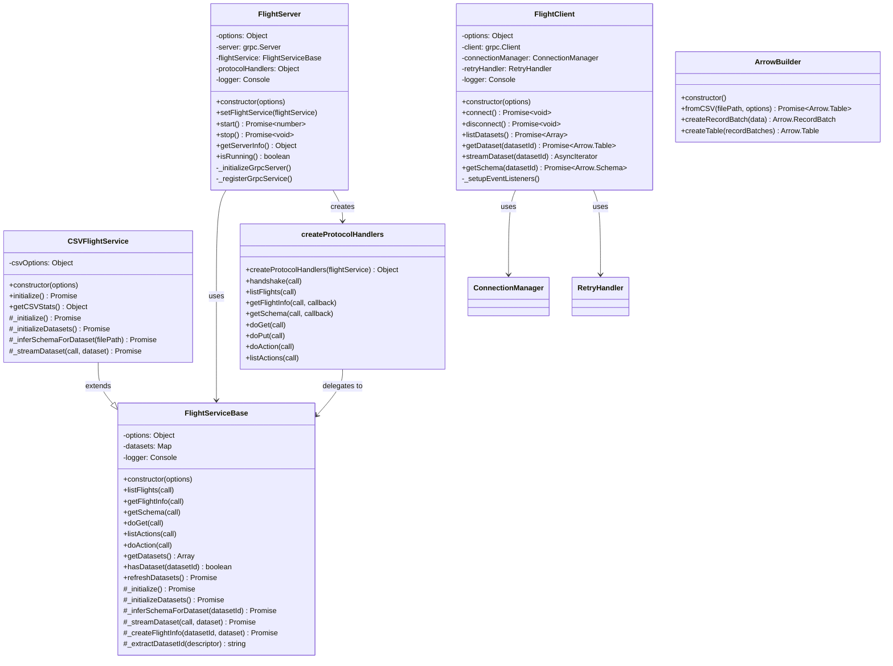

# Core Flight Package Architecture

This document provides comprehensive Mermaid diagrams showing the class structure, methods, and dependencies of the FlightStream packages.

## Package Structure

```
@flightstream/
├── core-server/          # Core Flight server framework
├── core-client/          # Core Flight client framework  
├── core-shared/          # Shared utilities and protocol helpers
├── adapters-csv/         # CSV file adapter
└── utils-arrow/          # Advanced Arrow utilities
```

## Class Hierarchy Diagram



## Method Flow Diagram


## Package Dependencies

```mermaid
graph TD
    A[@flightstream/core-server] --> B[@grpc/grpc-js]
    A --> C[@grpc/proto-loader]
    A --> D[apache-arrow]
    A --> E[@flightstream/core-shared]
    
    F[@flightstream/core-client] --> B
    F --> C
    F --> D
    F --> E
    
    G[@flightstream/core-shared] --> B
    G --> C
    
    H[@flightstream/adapters-csv] --> A
    H --> I[fast-csv]
    H --> J[@flightstream/utils-arrow]
    
    K[@flightstream/utils-arrow] --> D
    K --> L[pino]
    
    M[examples/basic-server] --> A
    M --> H
    
    N[examples/basic-client] --> F
    
    subgraph "External Dependencies"
        B
        C
        D
        I
        L
    end
    
    subgraph "FlightStream Packages"
        A
        E
        F
        H
        J
    end
    
    subgraph "Applications"
        M
        N
    end
```

## Server Lifecycle Diagram


## Client Lifecycle Diagram


## Data Flow Architecture


## Error Handling Architecture


## Performance Optimization

### Memory Management


### Connection Pooling


## Security Architecture


## Monitoring and Observability


This architecture provides a robust, scalable foundation for Apache Arrow Flight streaming services with comprehensive error handling, performance optimization, and monitoring capabilities. 