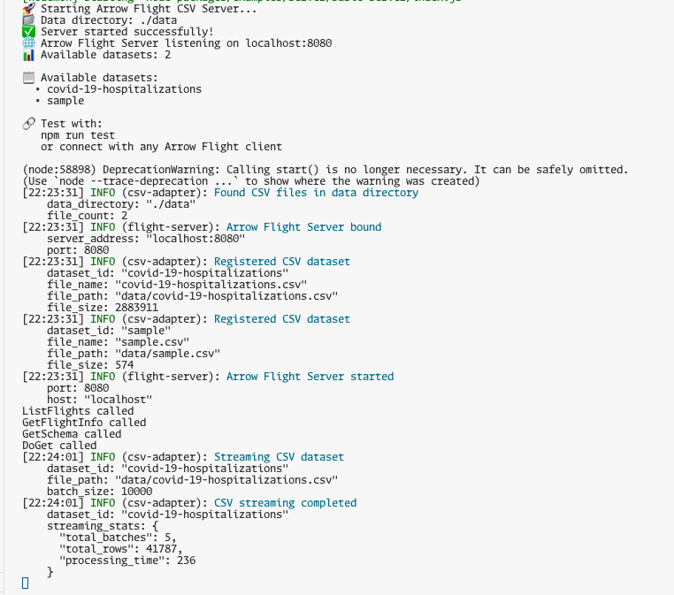
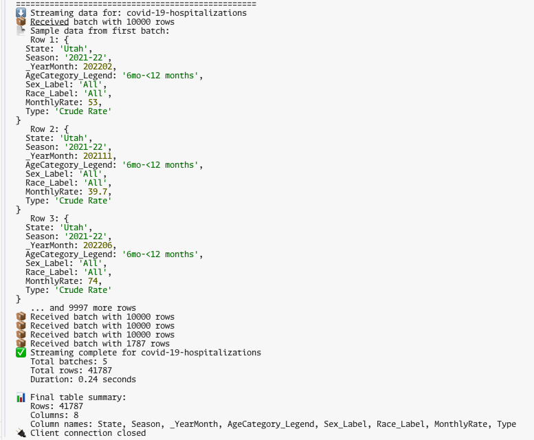
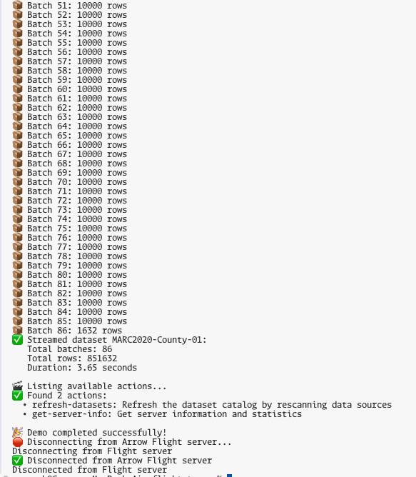

# 🚀 FlightStream - A Node.js-based Flight Server and Client Framework

[](https://opensource.org/licenses/MIT)
[](https://nodejs.org/)
[](https://www.npmjs.com/package/@flightstream/core-server)

> **⚠️ Alpha Release**: This is currently in alpha. APIs may change between releases. This is not production-ready software. For production use, consider waiting for the stable release or pinning to a specific alpha version.


A comprehensive, high-performance Apache Arrow Flight streaming framework for Node.js that enables efficient, real-time data streaming across distributed systems. Built with a modular plugin architecture, FlightStream provides both server-side streaming capabilities and client-side data access patterns, making it ideal for modern data pipelines, analytics applications, and microservices architectures.

## Use Cases

- **Data Engineering**: Stream CSV files to analytics engines (Apache Spark, DuckDB, Pandas)
- **API Modernization**: Replace REST APIs with efficient columnar data transfer
- **Real-time Analytics**: Power dashboards and BI tools with live data streams
- **Microservices**: Enable high-performance data sharing between services
- **Multi-language Integration**: Connect applications written in different programming languages

## 🚀 Features

<div class="feature-grid">
  <div class="feature">
    <h3>🏗️ Plugin Architecture</h3>
    <p>Extensible adapter system for any data source - CSV, databases, cloud storage</p>
  </div>
  
  <div class="feature">
    <h3>⚡ High Performance</h3>
    <p>Efficient gRPC streaming with Apache Arrow's columnar data format</p>
  </div>
  
  <div class="feature">
    <h3>🔧 Production Ready</h3>
    <p>Comprehensive error handling, monitoring hooks, and Docker support</p>
  </div>
  
  <div class="feature">
    <h3>👥 Multi-Language</h3>
    <p>Connect from Python, Java, C++, JavaScript using standard Arrow Flight clients</p>
  </div>
  
  <div class="feature">
    <h3>📊 Auto Schema Inference</h3>
    <p>Automatic Arrow schema detection from CSV files with type optimization</p>
  </div>
  
  <div class="feature">
    <h3>🌊 Streaming Support</h3>
    <p>Efficient streaming of large datasets with configurable batch sizes</p>
  </div>

  <div class="feature">
    <h3>💻 Developer Friendly</h3>
    <p>Rich examples, comprehensive documentation, and easy setup</p>
  </div>
</div>

## ⚡ Quick Start

```bash
# Clone and install
git clone https://github.com/ggauravr/flightstream.git
cd flightstream
npm install

# Start the example server
npm start

# Test with the first dataset found in the data/ directory
npm test

# Test with a specific dataset
npm test <dataset>
```

The server automatically discovers CSV files in the `data/` directory and serves them via Arrow Flight protocol.

### Expected Output

#### Server Terminal (`npm run dev`):


#### Client Terminal (`npm test`):


That's it! The server will automatically discover CSV files in the `data/` directory and stream them via Arrow Flight protocol. The test client will connect and display the streamed data in real-time. As you can see a CSV with ~41k rows is streamed to the client in .25s!

#### Client Terminal With a Specific Dataset(`npm test MARC2020-County-01`):


The test client will connect and display the streamed data specificed by the dataset id in real-time. In the example above, CSV with ~800k rows is streamed to the client in <4s!

### What just happened?
- **Flight Server**: Started on `localhost:8080` with CSV adapter
- **Sample Data**: Automatically discovered from `./data/` directory  
- **Test Client**: Connected via gRPC and streamed Arrow data
- **Live Reload**: Server restarts automatically when you modify code

## 📦 Packages

The monorepo contains focused, reusable packages:

| Package | Version | Description |
|---------|---------|-------------|
| **[@flightstream/core-server](https://www.npmjs.com/package/@flightstream/core-server)** | `1.0.0-alpha.7` | Core Flight server framework with gRPC support |
| **[@flightstream/core-client](https://www.npmjs.com/package/@flightstream/core-client)** | `1.0.0-alpha.3` | Core Flight client framework with connection management |
| **[@flightstream/core-shared](https://www.npmjs.com/package/@flightstream/core-shared)** | `1.0.0-alpha.3` | Shared utilities and protocol helpers |
| **[@flightstream/adapters-csv](https://www.npmjs.com/package/@flightstream/adapters-csv)** | `1.0.0-alpha.5` | CSV file adapter with streaming and schema inference |
| **[@flightstream/utils-arrow](https://www.npmjs.com/package/@flightstream/utils-arrow)** | `1.0.0-alpha.5` | Advanced Arrow utilities and type system |

## 🎯 Use Cases

- **Data Lakes**: Serve files efficiently from S3, GCS, Snowflake, or local storage
- **Analytics Pipelines**: Stream data to Apache Spark, DuckDB, or custom analytics  
- **Real-time ETL**: High-performance data transformation and streaming
- **API Modernization**: Replace REST APIs with efficient columnar data transfer for real-time analytics products
- **Multi-language Integration**: Connect Python, Java, C++, and JavaScript applications

## 📚 Documentation

<div class="feature-grid">
  <div class="feature">
    <a href="{{ '/contributing/' | relative_url }}" class="doc-card">
      <h4>🤝 Contributing</h4>
      <p>Bug fixes, enhancements, optimizations, docs, anything!</p>
    </a>
  </div>
  
  <div class="feature">
    <a href="{{ '/api-reference/' | relative_url }}" class="doc-card">
      <h4>📋 API Reference</h4>
      <p>Complete API documentation and examples</p>
    </a>
  </div>
  
  <div class="feature">
    <a href="{{ '/core-architecture/' | relative_url }}" class="doc-card">
      <h4>🏗️ Architecture</h4>
      <p>Core architecture diagrams and design patterns</p>
    </a>
  </div>
</div>

## 🔧 Examples

The project includes working examples:

- **Basic Server** (`examples/basic-server/`): Complete CSV server implementation
- **Basic Client** (`examples/basic-client/`): Client with connection management and streaming

## 🤝 Community

- **GitHub**: [ggauravr/flightstream](https://github.com/ggauravr/flightstream)
- **Issues**: [Report bugs and request features](https://github.com/ggauravr/flightstream/issues)
- **Discussions**: [Community discussions](https://github.com/ggauravr/flightstream/discussions)
- **Contributions**: Please see the [Contributing Guide](CONTRIBUTING.md) for details

## 📄 License

This project is licensed under the [MIT License](https://github.com/ggauravr/flightstream/blob/main/LICENSE).

## 🙏 Acknowledgments

- [Apache Arrow](https://arrow.apache.org/) for the columnar data format
- [DuckDB](https://duckdb.org/) for the embedded analytical database and the mind-blowing single-node performance
- [gRPC](https://grpc.io/) for the high-performance RPC framework 
- [Apache Arrow Flight](https://arrow.apache.org/docs/format/Flight.html) for the amazing message transfer protocol

<style>
.feature-grid {
  display: grid;
  grid-template-columns: repeat(auto-fit, minmax(280px, 1fr));
  gap: 2rem;
  margin: 2rem 0;
}

.feature {
  padding: 1.5rem;
  border: 1px solid #e1e4e8;
  border-radius: 8px;
  background: #f8f9fa;
}

.feature h3 {
  margin-top: 0;
  color: #0366d6;
}

.docs-grid {
  display: grid;
  grid-template-columns: repeat(auto-fit, minmax(250px, 1fr));
  gap: 1.5rem;
  margin: 2rem 0;
}

.doc-card {
  display: block;
  padding: 1.5rem;
  border: 1px solid #e1e4e8;
  border-radius: 8px;
  text-decoration: none;
  color: inherit;
  transition: all 0.2s ease;
  background: white;
}

.doc-card:hover {
  border-color: #0366d6;
  box-shadow: 0 4px 12px rgba(0,0,0,0.1);
  transform: translateY(-2px);
}

.doc-card h3 {
  margin-top: 0;
  color: #0366d6;
}

.doc-card p {
  margin-bottom: 0;
  color: #586069;
}
</style> 