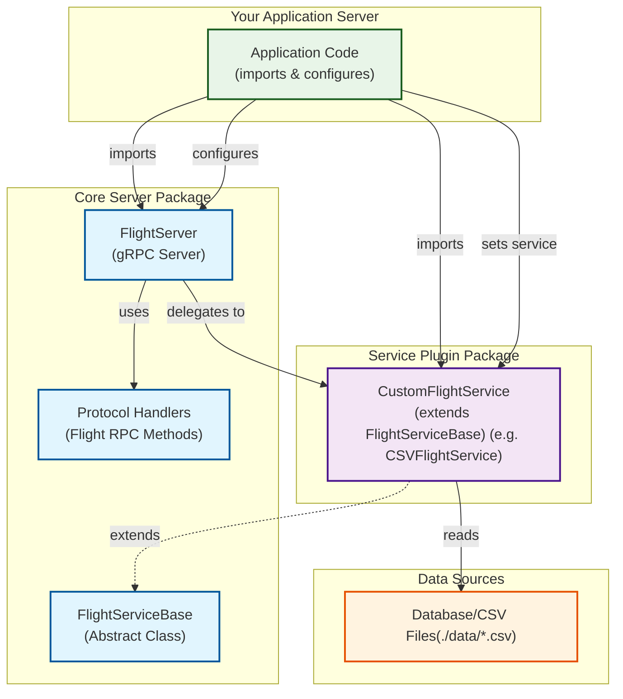

# ✈️ @flightstream/core-server

[](../../LICENSE)
[](https://nodejs.org/)
[](https://arrow.apache.org/)

Core Apache Arrow Flight server framework with plugin architecture for Node.js applications.

## 📋 Overview

The `@flightstream/core-server` package provides a generic, extensible framework for building Apache Arrow Flight servers in Node.js. It implements the Arrow Flight protocol using gRPC and provides a plugin architecture that allows you to easily add support for different data sources.

### Key Features

- **Core Arrow Flight Protocol**: Implementation of essential Arrow Flight RPC methods (read operations)
- **Plugin Architecture**: Extensible design for data source adapters
- **gRPC Integration**: High-performance communication built on gRPC
- **Easy Integration**: Simple API for building Flight servers
- **Lifecycle Management**: Built-in server startup, shutdown, and status monitoring

## 🏗️ Architecture

The core package follows a plugin architecture pattern:

```
┌─────────────────┐    ┌──────────────────┐    ┌─────────────────┐
│   gRPC Client   │    │   FlightServer   │    │ FlightService   │
│                 │◄──►│                  │◄──►│   (Plugin)      │
│                 │    │                  │    │                 │
└─────────────────┘    └──────────────────┘    └─────────────────┘
                              │
                              ▼
                       ┌──────────────────┐
                       │Protocol Handlers │
                       │                  │
                       └──────────────────┘
```

### Components

1. **FlightServer**: Main server class that manages gRPC connections and delegates to service plugins
2. **FlightService (Plugin)**: Data source adapters (CSV, Parquet, Database, etc.)
3. **Protocol Handlers**: Standard implementations of Arrow Flight RPC methods
4. **gRPC Client**: Any Arrow Flight client that connects to the server


## Complete Setup

This diagram shows how to build a complete Flight server application using the core server package:



### Setup Flow

1. **Core Server Package** (`@flightstream/core-server`) provides the foundation:
   - `FlightServer`: Main gRPC server implementing Arrow Flight protocol
   - `FlightServiceBase`: Abstract base class for data service plugins
   - `Protocol Handlers`: Standard Flight RPC method implementations

2. **Service Plugin Package** (e.g., `@flightstream/adapters-csv`) extends the core:
   - `CSVFlightService`: Concrete implementation extending `FlightServiceBase`
   - Handles CSV-specific data reading and Arrow conversion

3. **Your Application Server** brings it all together:
   - Imports `FlightServer` from core package
   - Imports service plugin (e.g., `CSVFlightService`)
   - Configures and connects the components
   - Manages lifecycle (start/stop)

4. **Data Sources** provide the actual data:
   - CSV files, databases, APIs, etc.
   - Service plugins handle the data access layer

## 📦 Installation

```bash
npm install @flightstream/core-server apache-arrow
```

## 🚀 Quick Start

### CSV Flight Server

The easiest way to get started is using the CSV adapter to serve CSV files:

```javascript
import { FlightServer } from '@flightstream/core-server';
import { CSVFlightService } from '@flightstream/adapters-csv';

// Create server
const server = new FlightServer({
  host: 'localhost',
  port: 8080
});

// Create CSV service pointing to your data directory
const csvService = new CSVFlightService({
  dataDirectory: './data'  // Directory containing your CSV files
});

// Connect service to server
server.setFlightService(csvService);

// Start server
const port = await server.start();
console.log(`CSV Flight Server running on port ${port}`);

// Graceful shutdown
process.on('SIGINT', async () => {
  await server.stop();
  process.exit(0);
});
```

### Complete Example

Create a simple server file (`server.js`):

```javascript
import { FlightServer } from '@flightstream/core-server';
import { CSVFlightService } from '@flightstream/adapters-csv';

async function startServer() {
  try {
    const server = new FlightServer({
      host: 'localhost',
      port: 8080
    });

    const csvService = new CSVFlightService({
      dataDirectory: './data'
    });

    server.setFlightService(csvService);
    
    const port = await server.start();
    console.log(`🚀 Flight Server running on port ${port}`);
    console.log(`📊 Serving CSV files from './data' directory`);
    
    // Graceful shutdown
    process.on('SIGINT', async () => {
      console.log('\n🛑 Shutting down server...');
      await server.stop();
      process.exit(0);
    });
    
  } catch (error) {
    console.error('❌ Failed to start server:', error);
    process.exit(1);
  }
}

startServer();
```

Run with:
```bash
node server.js
```

The server will automatically discover and serve all CSV files in the `./data` directory.

## 📝 Logging

The core server provides simple, flexible logging that works with any logger or the built-in console.

### Default Console Logging

By default, the server uses the standard `console` object:

```javascript
const server = new FlightServer({
  host: 'localhost',
  port: 8080
  // Uses console for logging
});
```

### Custom Logger

You can provide any logger that implements the basic logging interface:

```javascript
import pino from 'pino';

const logger = pino({
  level: 'info',
  transport: {
    target: 'pino-pretty'
  }
});

const server = new FlightServer({
  host: 'localhost',
  port: 8080,
  logger: logger
});
```

### Logger Interface

Your logger must implement these methods:
- `info(data, message)`: Informational messages with structured data
- `debug(data, message)`: Debug messages with structured data  
- `warn(data, message)`: Warning messages with structured data
- `error(data, message)`: Error messages with structured data

The server uses structured logging with data objects as the first parameter:

```javascript
// Example of how the server calls your logger
logger.info({ port: 8080, host: 'localhost' }, 'Arrow Flight Server started');
logger.error({ error: { message: err.message } }, 'Failed to start server');
```

### Compatible Loggers

The server works with popular logging libraries:

#### Pino (Recommended)
```javascript
import pino from 'pino';
const logger = pino();
```

#### Winston
```javascript
import winston from 'winston';
const logger = winston.createLogger({
  level: 'info',
  format: winston.format.combine(
    winston.format.timestamp(),
    winston.format.json()
  ),
  transports: [
    new winston.transports.Console()
  ]
});
```

#### Console (Default)
The built-in console works out of the box and will stringify data objects automatically.

## 📚 API Reference

### FlightServer

The main server class that manages gRPC connections and Arrow Flight protocol handling.

#### Constructor

```javascript
new FlightServer(options)
```

**Options:**
- `host` (string): Server hostname (default: 'localhost')
- `port` (number): Server port (default: 8080)
- `maxReceiveMessageLength` (number): Maximum message size in bytes (default: 100MB)
- `maxSendMessageLength` (number): Maximum send message size in bytes (default: 100MB)
- `logger` (object): Custom logger instance (default: `console`)

#### Methods

- `setFlightService(flightService)`: Set the Flight service adapter
- `start()`: Start the server, returns Promise<number> with the port
- `stop()`: Stop the server gracefully
- `isRunning()`: Check if server is running
- `getServerInfo()`: Get server configuration and status

### FlightServiceBase

Abstract base class for implementing Flight service adapters.

#### Constructor

```javascript
new FlightServiceBase(options)
```

**Options:**
- `logger` (object): Custom logger instance (default: `console`)
- Additional options specific to your service implementation

#### Required Methods (implement in your subclass)

- `_initialize()`: Initialize your service and data sources
- `_initializeDatasets()`: Discover and register datasets
- `_inferSchemaForDataset(datasetId)`: Return Arrow schema for a dataset
- `_streamDataset(call, dataset)`: Stream data to the client

#### Built-in Methods

- `listFlights(call)`: List available datasets
- `getFlightInfo(call)`: Get dataset metadata
- `getSchema(call)`: Get Arrow schema for a dataset
- `doGet(call)`: Stream dataset data
- `refreshDatasets()`: Refresh dataset registry

## 🛡️ Error Handling

The package provides comprehensive error handling with proper gRPC status codes:

- **NOT_FOUND**: Dataset not found
- **INVALID_ARGUMENT**: Invalid request parameters
- **INTERNAL**: Server internal errors
- **UNAVAILABLE**: Service unavailable

## 📡 Supported Arrow Flight Methods

### Fully Implemented
- **ListFlights**: Discover available datasets
- **GetFlightInfo**: Get dataset metadata
- **GetSchema**: Retrieve Arrow schema
- **DoGet**: Stream data to client
- **DoAction**: Execute custom actions
- **ListActions**: List available actions
- **Handshake**: Basic authentication handshake

### Limited Implementation
- **DoPut**: Basic stub for receiving data (not fully functional)

### Built-in Actions

- `refresh-datasets`: Refresh the dataset registry
- `get-server-info`: Get server information

## 🔗 Related Packages

- `@flightstream/adapters-csv`: CSV data source adapter
- `@flightstream/utils-arrow`: Arrow data processing utilities

## 🤝 Contributing

1. Fork the repository
2. Create a feature branch
3. Make your changes with tests
4. Submit a pull request

See [CONTRIBUTING.md](../../../CONTRIBUTING.md) for detailed guidelines.

## 📄 License

MIT License - see [LICENSE](../../../LICENSE) for details.

## 🔗 Learn More

- [Apache Arrow Flight Protocol](https://arrow.apache.org/docs/format/Flight.html)
- [gRPC Documentation](https://grpc.io/docs/)
- [Apache Arrow JavaScript](https://arrow.apache.org/docs/js/) 